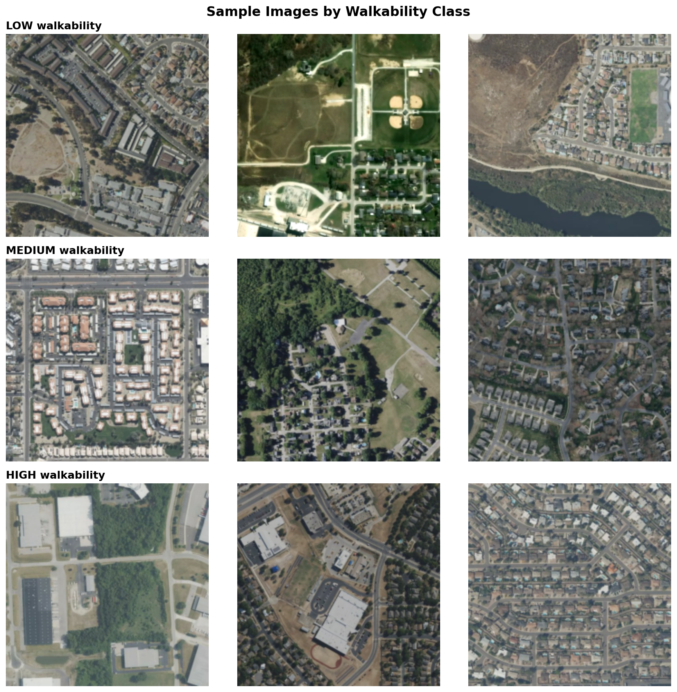
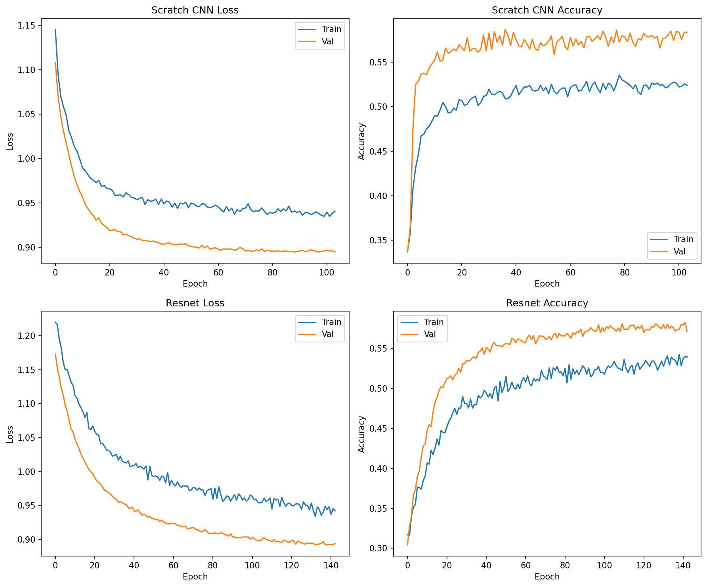
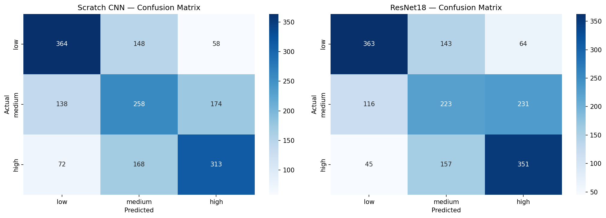

# CNN Prediction of Neighborhood Walkability from Satellite Imagery


## Project Overview and Purpose:

This project investigates predicting neighborhood walkability using overhead satellite imagery. "Walkability" is defined as the degree to which a built environment supports walking as a main mode of transportation, based on factors like sidewalk and road infrastructure, building and intersection density, etc. Walkability in urban environments plays a large role in things like public health, sustainability, and equitable city design, and is interesting to me personally as a spatial data science student.

The specific aim of this project is to assess whether a convolutional neural network trained solely on overhead aerial imagery can accurately classify neighborhood walkability scores without any ground-level data (i.e. Google Streetview).


## Dataset:

The dataset for this project was constructed from scratch, consisting of ~8,400 satellite image patches across the United States, labeled by neighborhood walkability class (low / medium / high) These data samples were derived from the [EPA National Walkability Index (NWI) geodatabase](https://www.epa.gov/smartgrowth/smart-location-mapping#walkability) and [Mapbox Static Images API satellite imagery](https://docs.mapbox.com/api/maps/static-images/). Each image is a 512×512 JPEG aerial photo (later normalized to 224x224) centered on a US census block group centroid, fetched at zoom level 16 (~0.3–0.6m resolution).

The dataset was built by filtering the NWI dataset to a representative subset of cities & fetching satellite imagery for the centroid coordinates of each neighborhood, effectively creating a large dataset of satellite imagery patches and their corresponding numerically encoded labels (low=0, medium=1, high=2). It has been pre-split into train, validation, and test sets with a split of 60%-20%-20%.

See [data.md](https://github.com/siegelhannah/deeplearning-walkability-cnn/blob/main/walkability/dataset/data.md) for more detailed dataset description, and [dataset_download.py](https://github.com/siegelhannah/deeplearning-walkability-cnn/blob/main/walkability/dataset/dataset_download.py) for specific construction details.

The dataset is stored on Talapas at `/projects/dsci410_510/data/walkability_dataset/` or can be re-downloaded via `dataset_download.py`

Example data samples from `data_demo.ipynb`:




## Models:

The models trained on this dataset include:
1. A CNN built from scratch
2. A pre-trained, fine-tuned ResNet18 model (pre-trained on ImageNet data)

The from-scratch CNN has two convolutional blocks (with conv layers, batch normalization, and max pooling) and 0.2 dropout on the fc linear layers. It uses a learning rate of 1e-5 and Early Stopping patience=15.

The pre-trained ResNet18 has 0.3 dropout on the fine-tuned fc linear layers, a learning rate of 1e-5, and Early Stopping patience=10.


## Training Instructions:

The boiler plate code/functions to train either model can be found in [train_model.py](https://github.com/siegelhannah/deeplearning-walkability-cnn/blob/main/walkability/train_model.py).

The script [train_compare_models.py](https://github.com/siegelhannah/deeplearning-walkability-cnn/blob/main/walkability/train_compare_models.py) runs `train_model.py` for each model using training dataloaders. The script compares overall performance between the two models by printing epoch summaries, plotting training and validation accuracy/loss over the training process, and outputting final accuracies and confusion matrices.

For convenience, `train_compare_models.py` can be run in a SLURM job on Talapas (or other HPC) using [train_compare.sh](https://github.com/siegelhannah/deeplearning-walkability-cnn/blob/main/walkability/train_compare.sh).


## Results:

This project is essentially a 3-class classification problem (low, medium, high walkability) using binned NWI scores as ground truth. Model performance is evaluated using overall accuracy, as well as a confusion matrix across the three walkability classes.

When trained for 150 epochs with data batch size 32 and all the other model parameters specified above, both models achieved around 55% accuracy on test data (the scratch CNN achieved 0.5523 and the fine-tuned ResNet18 achieved 0.5535).

Training progress:




Confusion matrix:




## Discussion and Limitations:

Interestingly, both models achieved similar performance despite one being built from scratch and the other being pre-trained. Both models performed better than random (random accuracy on a 3-class problem = 0.33), but still had relatively low accuracy.

The training curves show accuracy plateauing/converging at this low value, even with increased epochs, suggesting a performance ceiling for this type of classification problem.

The output confusion matrices offer more insight into where the models failed, showing common mis-classifications. Both models, when wrong, tended to predict a higher walkability class than the true class (for example, predicting more "high" than "low" when the true class was "medium"). In fact, the ResNet18 model actually predicted "high" _more_ than "medium" when the true class was "high". This is an interesting bias towards higher walkability predictions, suggesting that the model could have learned from the training data that predicting higher classes was a safer choice. 

Limitations of this project (in dataset construction and model training):
* The NWI data is different for every city: Census block groups/neighborhoods are not always the same size, and range from densely clustered to large and sprawling. This means satellite imagery fetched at the centroid coordinates of each neighborhood may not actually be representative of the neighborhood's true features (might be too big/too small). Also, the metric of walkability is calculated from a combination of features, some of which can't be determined by overhead satellite imagery alone (e.g., sidewalk quality, distance from transit centers). For these reasons there is an inherent limitation of trying to predict a street-level metric with overhead imagery data.
* The pre-trained ResNet18 model was trained on ImageNet data, which isn't satellite imagery. Future work on this project could include fine-tuning a model specifically built for analyzing patterns in overhead satellite imagery photos.


## General Usage:

1. Clone the repo and install:

```bash
git clone https://github.com/siegelhannah/deeplearning-walkability-cnn.git
cd deeplearning-walkability-cnn
pip install -e .
```

2. Run notebooks/data_demo.ipynb to load and explore the dataset, or run notebooks/Evaluation.ipynb to predict on the test dataloader with fully trained models.


## Data Files:

* The dataset is stored on Talapas at `/projects/dsci410_510/data/walkability_dataset/` or can be re-downloaded via [dataset_download.py](https://github.com/siegelhannah/deeplearning-walkability-cnn/blob/main/walkability/dataset/dataset_download.py)
* The weights of both trained models are located at [lightning_logs/version_44448914/checkpoints](https://github.com/siegelhannah/deeplearning-walkability-cnn/tree/main/walkability/lightning_logs/version_44448914/checkpoints).

